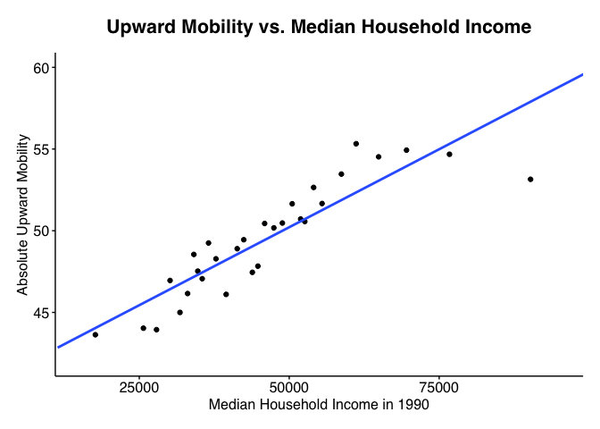
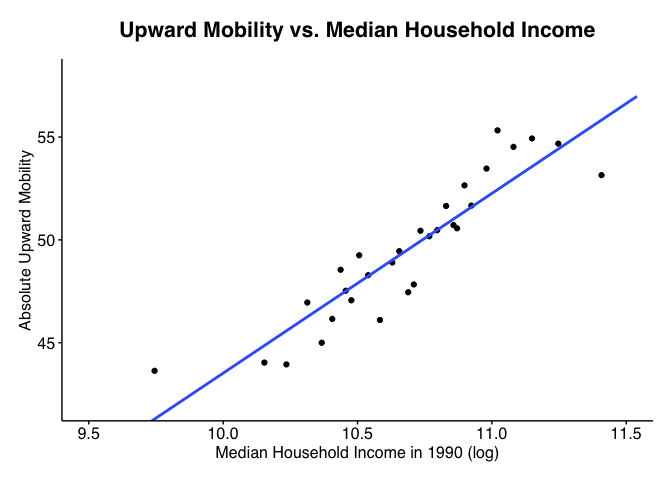
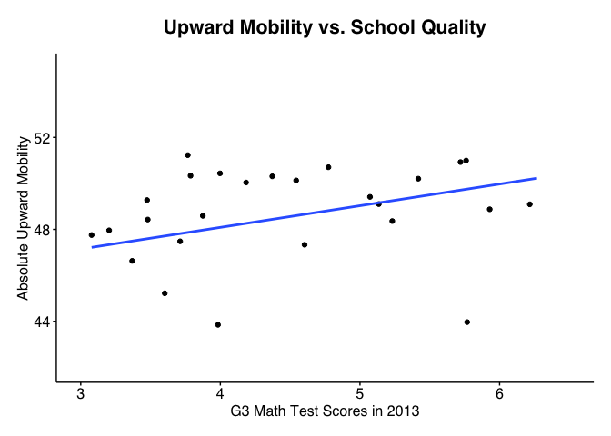

Economic Mobility Analysis Part 2
================
Lewis Tu
2025-05-02

- Read data

``` r
atlas <- read_dta("atlas.dta")

# middlesex county filter
midd <- atlas %>% filter(state==25, county==017)
```

- Comparing Absolute Upward Mobility

``` r
# 2010 FIPS codes
belmont_tracts <- c(357100, 357200, 357300, 357400, 357500, 357600, 357700, 357800)
home_state <- 25 #MA
home_county <- 017 #Middlesex

# Belmont tracts
belmont_data <- subset(atlas,
  state  == home_state &
  county == home_county &
  tract  %in% belmont_tracts
)
belmont_mean <- mean(belmont_data$kfr_pooled_pooled_p25, na.rm = TRUE)

# My county
my_county <- subset(atlas, state == home_state & county == home_county)
county_mean <- mean(my_county$kfr_pooled_pooled_p25, na.rm = TRUE)

# My state
my_state <- subset(atlas, state == home_state)
state_mean <- mean(my_state$kfr_pooled_pooled_p25, na.rm = TRUE)

# United States
us_mean <- mean(atlas$kfr_pooled_pooled_p25, na.rm = TRUE)

# Compare
compare_df <- data.frame(
  Region = c("Belmont", "Middlesex County", "MA", "US"),
  Mean_Upward_Mobility = c(belmont_mean, county_mean, state_mean, us_mean)
)

compare_df
```

    ##             Region Mean_Upward_Mobility
    ## 1          Belmont             59.35570
    ## 2 Middlesex County             49.45877
    ## 3               MA             46.40324
    ## 4               US             42.85813

- Grade 3 Math Scores vs Absolute Upward Mobility

``` r
# Draw binned scatter plot with linear best fit line
ggplot(midd, aes(x = gsmn_math_g3_2013, y = kfr_pooled_pooled_p25)) +
  stat_binmean(n = 30, geom = "point") +
  stat_smooth(method = "lm", se = FALSE) +
  coord_cartesian(xlim = c(3, 6.5), ylim = c(42, 60)) +
  labs(x = "G3 Math Test Scores in 2013",
    y = "Absolute Upward Mobility",
    title = "Upward Mobility vs. School Quality") +
  oi_style()
```

    ## Warning in oi_style(): 'oi_style' is deprecated.
    ## Use 'theme_oi' instead.
    ## See help("Deprecated")

    ## Warning: Removed 2 rows containing non-finite outside the scale range
    ## (`stat_binmean()`).

    ## `geom_smooth()` using formula = 'y ~ x'

    ## Warning: Removed 2 rows containing non-finite outside the scale range
    ## (`stat_smooth()`).

<!-- -->

``` r
# Regression
lm_kfr_math <- lm(kfr_pooled_pooled_p25 ~ gsmn_math_g3_2013, data = midd)

# Report coefficients and standard errors
coeftest(lm_kfr_math, vcov = vcovHC(lm_kfr_math, type="HC1"))
```

    ## 
    ## t test of coefficients:
    ## 
    ##                   Estimate Std. Error t value              Pr(>|t|)    
    ## (Intercept)       37.74052    1.42690 26.4494 < 0.00000000000000022 ***
    ## gsmn_math_g3_2013  2.70947    0.32821  8.2554  0.000000000000004289 ***
    ## ---
    ## Signif. codes:  0 '***' 0.001 '**' 0.01 '*' 0.05 '.' 0.1 ' ' 1

- Fraction with BA or higher vs Absolute Upward Mobility

``` r
# Binned scatter plot with linear best fit line
ggplot(midd, aes(x = frac_coll_plus2010, y = kfr_pooled_pooled_p25)) +
  stat_binmean(n = 30, geom = "point") +
  stat_smooth(method = "lm", se = FALSE) +
  coord_cartesian(xlim = c(0, 1), ylim = c(42, 56)) +
  labs(x = "Fraction with BA or higher in 2010",
    y = "Absolute Upward Mobility",
    title = "Upward Mobility vs. Educational Attainment") +
  oi_style()
```

    ## Warning in oi_style(): 'oi_style' is deprecated.
    ## Use 'theme_oi' instead.
    ## See help("Deprecated")

    ## `geom_smooth()` using formula = 'y ~ x'

<!-- -->

``` r
# Regression
lm_kfr_coll <- lm(kfr_pooled_pooled_p25 ~ frac_coll_plus2010, data = midd)

# Report coefficients and standard errors
coeftest(lm_kfr_coll, vcov = vcovHC(lm_kfr_coll, type="HC1"))
```

    ## 
    ## t test of coefficients:
    ## 
    ##                    Estimate Std. Error t value              Pr(>|t|)    
    ## (Intercept)        45.41317    0.76367 59.4668 < 0.00000000000000022 ***
    ## frac_coll_plus2010  8.06179    1.67089  4.8249           0.000002186 ***
    ## ---
    ## Signif. codes:  0 '***' 0.001 '**' 0.01 '*' 0.05 '.' 0.1 ' ' 1

- Median Household Income vs Absolute Upward Mobility

``` r
# Binned scatter plot with linear best fit line
ggplot(midd, aes(x = med_hhinc1990, y = kfr_pooled_pooled_p25)) +
  stat_binmean(n = 30, geom = "point") +
  stat_smooth(method = "lm", se = FALSE) +
  coord_cartesian(xlim = c(15000, 95000), ylim = c(42, 60)) +
  labs(x = "Median Household Income in 1990",
    y = "Absolute Upward Mobility",
    title = "Upward Mobility vs. Median Household Income") +
  oi_style()
```

    ## Warning in oi_style(): 'oi_style' is deprecated.
    ## Use 'theme_oi' instead.
    ## See help("Deprecated")

    ## `geom_smooth()` using formula = 'y ~ x'

<!-- -->

- Log Median Household Income vs Absolute Upward Mobility

``` r
# Binned scatter plot with linear best fit line
ggplot(midd, aes(x = log(med_hhinc1990), y = kfr_pooled_pooled_p25)) +
  stat_binmean(n = 30, geom = "point") +
  stat_smooth(method = "lm", se = FALSE) +
  coord_cartesian(xlim = c(9.5, 11.5), ylim = c(42, 58)) +
  labs(x = "Median Household Income in 1990 (log)",
    y = "Absolute Upward Mobility",
    title = "Upward Mobility vs. Median Household Income") +
  oi_style()
```

    ## Warning in oi_style(): 'oi_style' is deprecated.
    ## Use 'theme_oi' instead.
    ## See help("Deprecated")

    ## `geom_smooth()` using formula = 'y ~ x'

<!-- -->

``` r
# Regression
lm_kfr_inc <- lm(kfr_pooled_pooled_p25 ~ log(med_hhinc1990), data = midd)

# Report coefficients and standard errors
coeftest(lm_kfr_inc, vcov = vcovHC(lm_kfr_inc, type="HC1"))
```

    ## 
    ## t test of coefficients:
    ## 
    ##                     Estimate Std. Error t value              Pr(>|t|)    
    ## (Intercept)        -43.88663    8.73772 -5.0227          0.0000008551 ***
    ## log(med_hhinc1990)   8.74062    0.82284 10.6225 < 0.00000000000000022 ***
    ## ---
    ## Signif. codes:  0 '***' 0.001 '**' 0.01 '*' 0.05 '.' 0.1 ' ' 1

- Multivariate regressions
  $$\text{UpwardMobility}_i \;=\; \beta_0 
  \;+\;\beta_1\,\text{Grade3MathScore}_i
  \;+\;\beta_2\,\%\text{CollegeGrads}_i
  \;+\;\beta_3\,\log(\text{MedianIncome}_i)
  \;+\;\varepsilon_i$$

``` r
# Multivariate regression on three predictors above
multi_kfr <- lm(kfr_pooled_pooled_p25 ~ gsmn_math_g3_2013 + frac_coll_plus2010 + log(med_hhinc1990), data = midd)

# Coefficient test
coeftest(multi_kfr, vcov = vcovHC(multi_kfr, type="HC1"))
```

    ## 
    ## t test of coefficients:
    ## 
    ##                     Estimate Std. Error t value          Pr(>|t|)    
    ## (Intercept)        -32.49109    9.93951 -3.2689          0.001201 ** 
    ## gsmn_math_g3_2013    1.14173    0.43617  2.6176          0.009288 ** 
    ## frac_coll_plus2010  -1.39985    1.82203 -0.7683          0.442897    
    ## log(med_hhinc1990)   7.27742    1.01754  7.1519 0.000000000006155 ***
    ## ---
    ## Signif. codes:  0 '***' 0.001 '**' 0.01 '*' 0.05 '.' 0.1 ' ' 1

``` r
# Multivariate regression on many factors
m_control <- lm(
  kfr_pooled_pooled_p25 ~ gsmn_math_g3_2013
    + log(med_hhinc1990)
    + frac_coll_plus2010
    + singleparent_share2010
    + share_white2010 + share_black2010 + share_hisp2010 + share_asian2010
    + homeownership2010
    + job_density_2013 + popdensity2010
    + share_urban2010,
  data = midd
)

# Coefficient test
coeftest(m_control, vcov = vcovHC(m_control, type="HC1"))
```

    ## 
    ## t test of coefficients:
    ## 
    ##                              Estimate     Std. Error t value   Pr(>|t|)    
    ## (Intercept)            -32.5417159164  20.0900511706 -1.6198   0.106321    
    ## gsmn_math_g3_2013        0.8330142253   0.4987952468  1.6701   0.095945 .  
    ## log(med_hhinc1990)       6.1131623739   1.8721839247  3.2653   0.001219 ** 
    ## frac_coll_plus2010      -2.9471043182   2.5284643839 -1.1656   0.244708    
    ## singleparent_share2010   3.7167020865   3.1451033971  1.1817   0.238238    
    ## share_white2010         10.9504234940   3.6780645404  2.9772   0.003144 ** 
    ## share_black2010         -2.9615290340   5.7939257898 -0.5111   0.609624    
    ## share_hisp2010           8.8190197281   5.9715433131  1.4768   0.140760    
    ## share_asian2010         32.8278134366   7.5277423221  4.3609 0.00001779 ***
    ## homeownership2010        0.4566923608   3.0627021206  0.1491   0.881563    
    ## job_density_2013        -0.0000093008   0.0000388864 -0.2392   0.811128    
    ## popdensity2010          -0.0000366205   0.0000541933 -0.6757   0.499724    
    ## share_urban2010          2.7888530446   2.1254918640  1.3121   0.190484    
    ## ---
    ## Signif. codes:  0 '***' 0.001 '**' 0.01 '*' 0.05 '.' 0.1 ' ' 1

- Reasoning by conditioning

``` r
# Filter to bottom quintile
low_inc <- midd %>% filter(med_hhinc1990 < quantile(med_hhinc1990, .2))
lm_low_kfr_math <- lm(kfr_pooled_pooled_p25 ~ gsmn_math_g3_2013, data = low_inc)
coeftest(lm_low_kfr_math, vcov = vcovHC(lm_low_kfr_math, type="HC1"))
```

    ## 
    ## t test of coefficients:
    ## 
    ##                   Estimate Std. Error t value            Pr(>|t|)    
    ## (Intercept)        59.3995     6.1164  9.7115 0.00000000000006398 ***
    ## gsmn_math_g3_2013  -4.0952     1.7154 -2.3873             0.02014 *  
    ## ---
    ## Signif. codes:  0 '***' 0.001 '**' 0.01 '*' 0.05 '.' 0.1 ' ' 1

``` r
# Filter to upper quintile
high_inc <- midd %>% filter(med_hhinc1990 > quantile(med_hhinc1990, .2))
lm_high_kfr_math <- lm(kfr_pooled_pooled_p25 ~ gsmn_math_g3_2013, data = high_inc)
coeftest(lm_high_kfr_math, vcov = vcovHC(lm_high_kfr_math, type="HC1"))
```

    ## 
    ## t test of coefficients:
    ## 
    ##                   Estimate Std. Error t value              Pr(>|t|)    
    ## (Intercept)       40.53852    1.59506 25.4150 < 0.00000000000000022 ***
    ## gsmn_math_g3_2013  2.22691    0.35583  6.2583        0.000000001689 ***
    ## ---
    ## Signif. codes:  0 '***' 0.001 '**' 0.01 '*' 0.05 '.' 0.1 ' ' 1

``` r
# Filter to bottom half
low_inc <- midd %>% filter(med_hhinc1990 < quantile(med_hhinc1990, .4))
lm_low_kfr_math <- lm(kfr_pooled_pooled_p25 ~ gsmn_math_g3_2013, data = low_inc)
coeftest(lm_low_kfr_math, vcov = vcovHC(lm_low_kfr_math, type="HC1"))
```

    ## 
    ## t test of coefficients:
    ## 
    ##                   Estimate Std. Error t value            Pr(>|t|)    
    ## (Intercept)       45.40227    4.22377 10.7492 <0.0000000000000002 ***
    ## gsmn_math_g3_2013  0.26153    1.17185  0.2232              0.8238    
    ## ---
    ## Signif. codes:  0 '***' 0.001 '**' 0.01 '*' 0.05 '.' 0.1 ' ' 1

``` r
# Filter to upper half
high_inc <- midd %>% filter(med_hhinc1990 > quantile(med_hhinc1990, .6))
lm_high_kfr_math <- lm(kfr_pooled_pooled_p25 ~ gsmn_math_g3_2013, data = high_inc)
coeftest(lm_high_kfr_math, vcov = vcovHC(lm_high_kfr_math, type="HC1"))
```

    ## 
    ## t test of coefficients:
    ## 
    ##                   Estimate Std. Error t value              Pr(>|t|)    
    ## (Intercept)       45.24457    2.58812 17.4816 < 0.00000000000000022 ***
    ## gsmn_math_g3_2013  1.53165    0.52246  2.9316              0.004011 ** 
    ## ---
    ## Signif. codes:  0 '***' 0.001 '**' 0.01 '*' 0.05 '.' 0.1 ' ' 1

- Lockbox validation

``` r
library(dplyr)

# 1. Read & filter lockbox as you already have
lbox      <- read_dta("lockbox_atlas.dta")
lbox_midd <- lbox %>% 
  filter(state==25, county==017) %>%
  transmute(
    state, county, tract,
    kfr25_8489 = lockbox_kfr_pooled_pooled_p25
  )

# 2. Merge onto your original midd
df_lock <- midd %>% 
  left_join(
    lbox_midd,
    by = c("state","county","tract")
  )

# SECTION: Upward Mobility vs G3 Math Scores
# Draw binned scatter plot with linear best fit line
ggplot(df_lock, aes(x = gsmn_math_g3_2013, y = kfr25_8489)) +
  stat_binmean(n = 30, geom = "point") +
  stat_smooth(method = "lm", se = FALSE) +
  coord_cartesian(xlim = c(3, 6.5), ylim = c(42, 55)) +
  labs(x = "G3 Math Test Scores in 2013",
    y = "Absolute Upward Mobility",
    title = "Upward Mobility vs. School Quality") +
  oi_style()
```

    ## Warning in oi_style(): 'oi_style' is deprecated.
    ## Use 'theme_oi' instead.
    ## See help("Deprecated")

    ## Warning: Removed 2 rows containing non-finite outside the scale range
    ## (`stat_binmean()`).

    ## `geom_smooth()` using formula = 'y ~ x'

    ## Warning: Removed 2 rows containing non-finite outside the scale range
    ## (`stat_smooth()`).

<!-- -->

``` r
# Regression
lock_kfr_math <- lm(kfr25_8489 ~ gsmn_math_g3_2013, data = df_lock)

# Report coefficients and standard errors
coeftest(lock_kfr_math, vcov = vcovHC(lock_kfr_math, type="HC1"))
```

    ## 
    ## t test of coefficients:
    ## 
    ##                   Estimate Std. Error t value              Pr(>|t|)    
    ## (Intercept)       44.31891    1.09388 40.5153 < 0.00000000000000022 ***
    ## gsmn_math_g3_2013  0.94199    0.25652  3.6722             0.0002828 ***
    ## ---
    ## Signif. codes:  0 '***' 0.001 '**' 0.01 '*' 0.05 '.' 0.1 ' ' 1

``` r
# Multivariate regression on three predictors 
lock_multi_kfr <- lm(kfr25_8489  ~ gsmn_math_g3_2013 + frac_coll_plus2010 + log(med_hhinc1990), data = df_lock)

# Coefficient test
coeftest(lock_multi_kfr, vcov = vcovHC(lock_multi_kfr, type="HC1"))
```

    ## 
    ## t test of coefficients:
    ## 
    ##                    Estimate Std. Error t value     Pr(>|t|)    
    ## (Intercept)         0.90477    8.29354  0.1091      0.91320    
    ## gsmn_math_g3_2013   0.36022    0.39981  0.9010      0.36830    
    ## frac_coll_plus2010 -3.83094    1.66333 -2.3032      0.02193 *  
    ## log(med_hhinc1990)  4.48104    0.86216  5.1975 0.0000003666 ***
    ## ---
    ## Signif. codes:  0 '***' 0.001 '**' 0.01 '*' 0.05 '.' 0.1 ' ' 1

``` r
# Multivariate regression on many factors
lock_m_control <- lm(
  kfr25_8489  ~ gsmn_math_g3_2013
    + log(med_hhinc1990)
    + frac_coll_plus2010
    + singleparent_share2010
    + share_white2010 + share_black2010 + share_hisp2010 + share_asian2010
    + homeownership2010
    + job_density_2013 + popdensity2010
    + share_urban2010,
  data = df_lock
)

# Coefficient test
coeftest(lock_m_control, vcov = vcovHC(lock_m_control, type="HC1"))
```

    ## 
    ## t test of coefficients:
    ## 
    ##                            Estimate   Std. Error t value  Pr(>|t|)    
    ## (Intercept)            22.957861606 17.536746251  1.3091 0.1914859    
    ## gsmn_math_g3_2013       0.084448216  0.421983309  0.2001 0.8415197    
    ## log(med_hhinc1990)      1.816153842  1.744182643  1.0413 0.2985861    
    ## frac_coll_plus2010     -4.436385665  2.495918476 -1.7775 0.0764995 .  
    ## singleparent_share2010 -0.499264946  2.198183307 -0.2271 0.8204793    
    ## share_white2010         5.572618390  2.766529369  2.0143 0.0448644 *  
    ## share_black2010        -6.428221986  3.720660121 -1.7277 0.0850625 .  
    ## share_hisp2010          1.342019908  4.608187162  0.2912 0.7710791    
    ## share_asian2010        20.112366423  5.665556180  3.5499 0.0004467 ***
    ## homeownership2010       0.482196299  2.521355338  0.1912 0.8484623    
    ## job_density_2013       -0.000024965  0.000021952 -1.1372 0.2563461    
    ## popdensity2010         -0.000045090  0.000039557 -1.1399 0.2552420    
    ## share_urban2010         2.830711947  1.244982986  2.2737 0.0236861 *  
    ## ---
    ## Signif. codes:  0 '***' 0.001 '**' 0.01 '*' 0.05 '.' 0.1 ' ' 1
